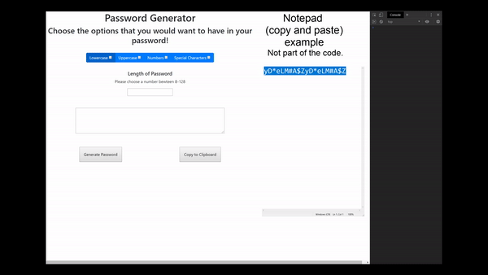

# passwordGenerator
# Designer
 
Hello my name is Eric and this is my project Password Generator! A quick and easy way to generate a password through what the user desires.

# Password Generator
  
This project is for a user who wants to randomly generate a password to use on whatever requires a password. The user has options to choose from lower case, upper case, numbers, and or special characters. There are requirements that is the user must choose in order to make the code work. One of the options must be chosen and the password can not be less than eight or higher than 128. Once all requirements have been met, a password will be generated. If the user doesn't approve of the generated password, they have the option to click the generate button as many time as they desire till that perfect is generated. When satisfied with the password they can copy it to their clipboard by clicking on the "clip to clipboard" button.  

# Credits
This project was met with a lot of trial and errors but to complete it I had help from the following:
<ul>
  <li> Dan Geare (Classmate)
    
 Dan gave me the whole fundamental javascript run down. He taught me how to pseduo code out this       project helping me out an immeasurable amount.
  <li> Christopher Ellis (Classmate)
    
 Chris showed me a video that helped me out with some bugs that the code had.
  <li> TechnicalCafe (Youtube Channel)
    
This is the channel that Chris showed me and it helped me out with the bugs that I encountered.
    
 https://www.youtube.com/watch?v=9sT03jEwcaw
  <li> W3Schools
  <li> Other website
</ul>
    
# License
License Code is open source, for as long as the code is not exactly identical
